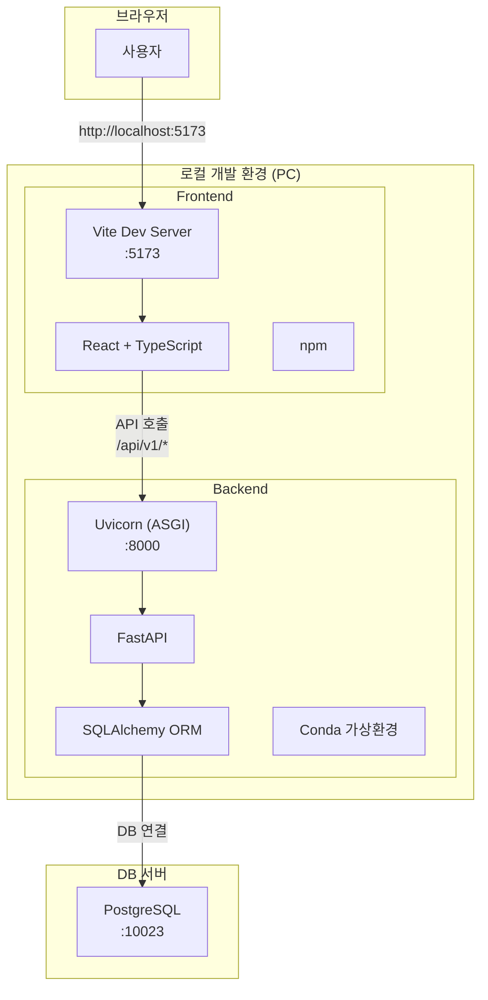
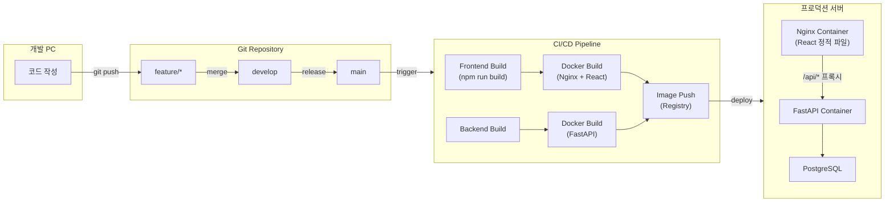
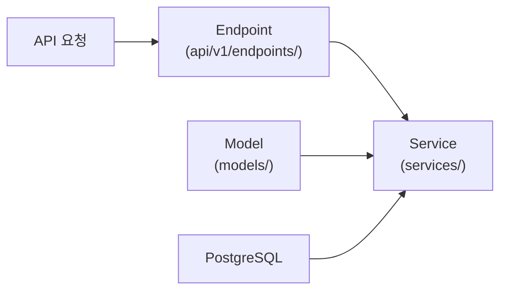
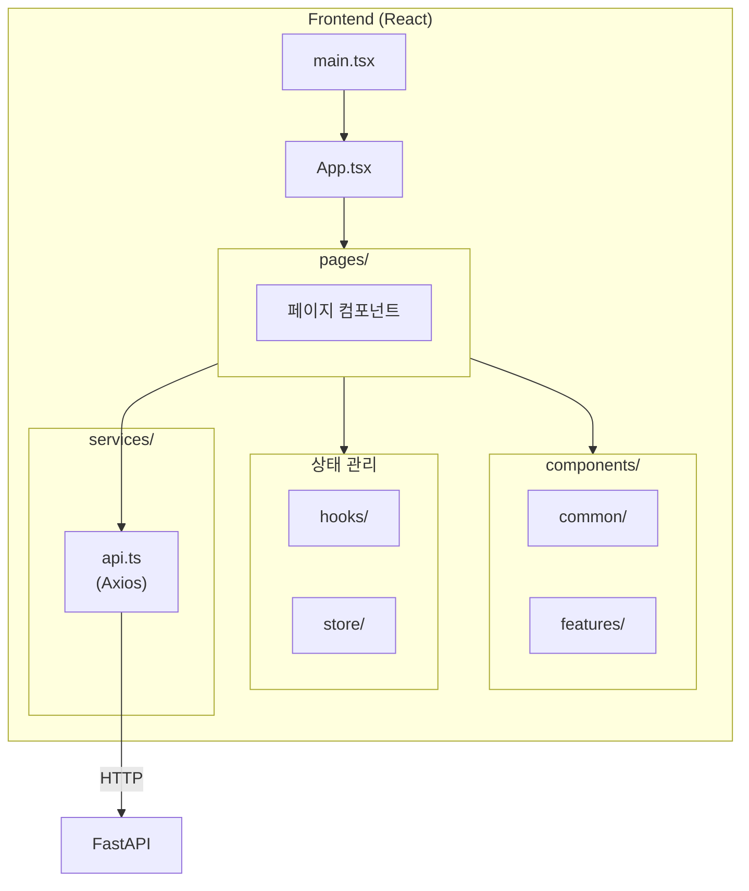

# Infolink 프로젝트 아키텍처

## 전체 구성도

## 배포 흐름

## 백엔드 레이어 구조

## 프론트엔드 구조

## 기술 스택

| 구분 | 개발 환경 | 프로덕션 환경 |
|------|----------|--------------|
| 프론트엔드 | Vite Dev Server | Nginx + React Build |
| 백엔드 | Uvicorn (직접 실행) | Docker Container |
| 데이터베이스 | PostgreSQL (서버) | PostgreSQL |
| 패키지 관리 | npm, pip/conda | Docker Image |

## 나중에 만들 파일 (CI/CD)

| 파일 | 용도 | 상태 |
|------|------|------|
| `frontend/Dockerfile` | React 빌드 + Nginx 이미지 | 예정 |
| `backend/Dockerfile` | FastAPI + Uvicorn 이미지 | 예정 |
| `docker-compose.yml` | 로컬 통합 테스트용 | 예정 |
| `docker-compose.prod.yml` | 프로덕션 배포용 | 예정 |
| `.gitlab-ci.yml` | CI/CD 파이프라인 | 예정 |
